# Features

### Navbar

* The navigation bar at the top of the website includes a website logo and allows users to access different pages such as Home, Cocktail products, Reviews, Wishlist, Login/Logout/Registration/Profile, Shopping Bag and search.
* Every page has an active navbar link in the shape of cocktail so users know on what page they are.

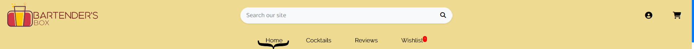

* Above the navigation bar menu user can see also changing banner of deals and promotions, banner is changing every 5s with smooth transition effect.

* From the navigation bar manu user can also access search bar and look for specific products

* For smaller devices navbar is collapsible 
 

* Search bar collapsed

* After adding items to the wishlist, wishlist link with number of items is shown in the navbar.

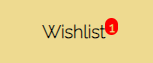

* After adding items to the shopping bag, shopping bag link with num of items is shown in the navbar.

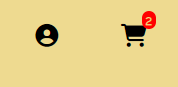

### Footer 

* Footer section at the bottom of the website include social links, contact information, bartender box picture as well as newsletter form, Terms and Conditions of the website link and Privacy policy link

### Home page 

* On the home page, there is a prominent and responsive image showcasing a cocktail image. Additionally, there is a "Shop Now" button next to the image with welcome text. Clicking on the "Shop Now" button will direct the user to the products page where they can explore and purchase the various cocktail options.

### Cocktails products page

* This page allows users to view all cocktails available. It provides various sorting options, and if the user has admin privileges, they can also edit or delete products directly from this page.

### Cocktails products detail page

* When a user clicks on a specific cocktail product, they are taken to the product detail page. Here, they can view detailed information about the product such as price, add it to the shopping bag or wishlist, rate the product if signed in, read and write reviews, and adjust the quantity before adding it to the shopping bag.

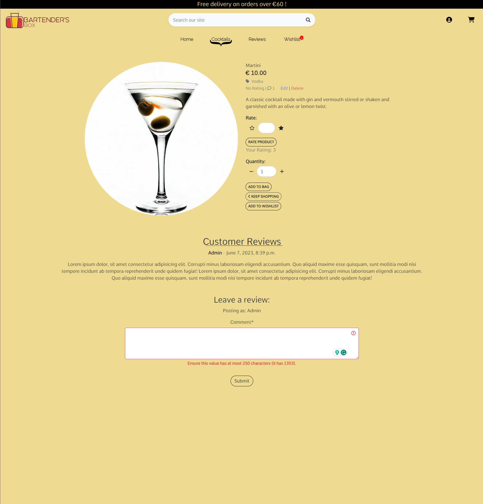

* The rating system allows users to rate the product on a scale of 1 to 5 stars, with each user allowed to provide only one rating when signed in.

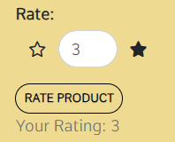

* Adding review is limited to 250 characters, if 250 characters are exceeded than, error message is shown below after submiting.

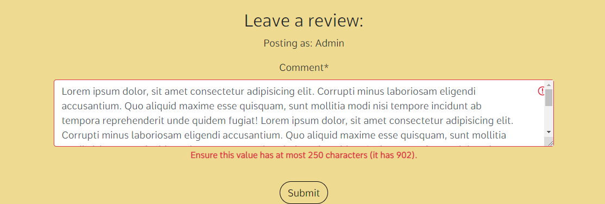

### Reviews Page

* On this page, users can view all the reviews for each product on the website.

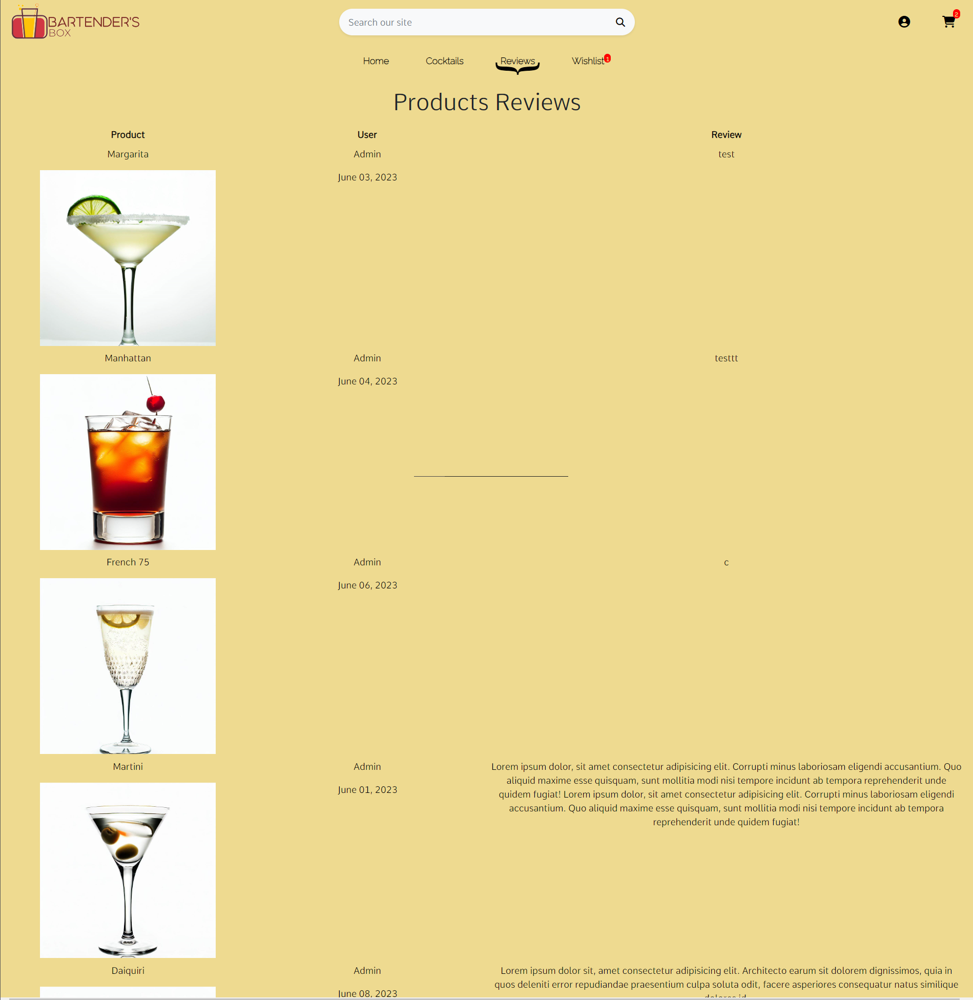

### Wishlist Page

* The wishlist page displays all the products that the user has added to their wishlist. Users have the option to delete items from the wishlist or click on a product to view its details.

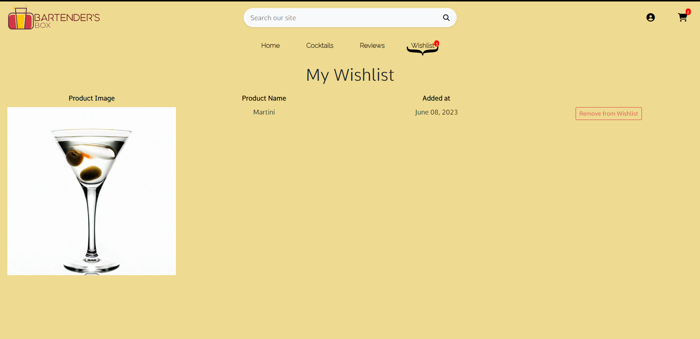

### User registration and authentication pages

* These pages allow users to create an account, log in, and access additional features of the website, such as saving shipping details and viewing order history.

Sign up page 
- After Sign up, email with verification link is sent.

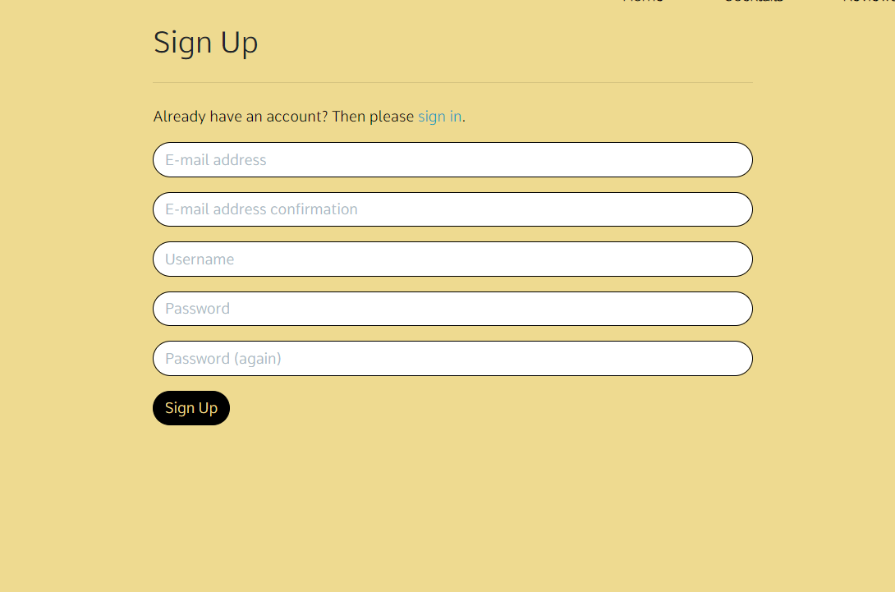

Login page

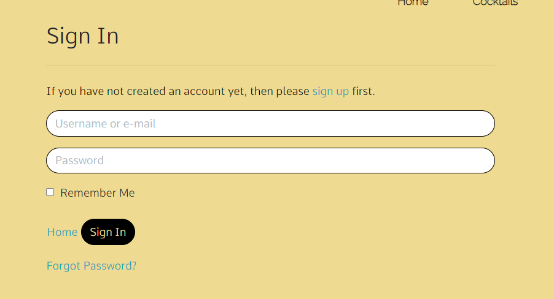

Log out page

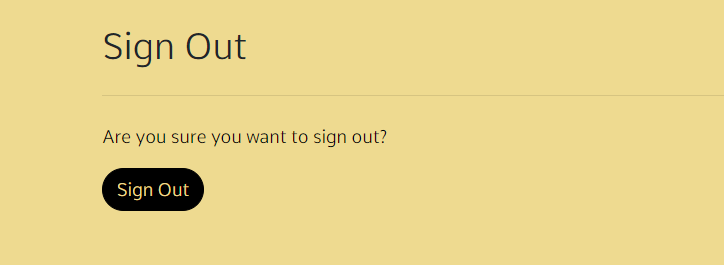

### User Profile page

* The user profile page allows users to view their order history and also view and update their shipping details.

Profile 

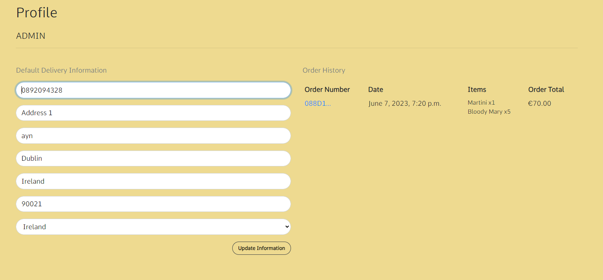

### Shopping Bag

* The shopping bag page displays all the products that the user has added for purchase. It provides a summary of the selected items, including their images, names, quantities, prices, and a subtotal for each product.
* Users can update the quantity of each item or remove products from the shopping bag.
* The page also calculates the total order value and provides additional information such as shipping costs and estimated delivery dates.
* Users can proceed to the checkout page to complete their purchase.

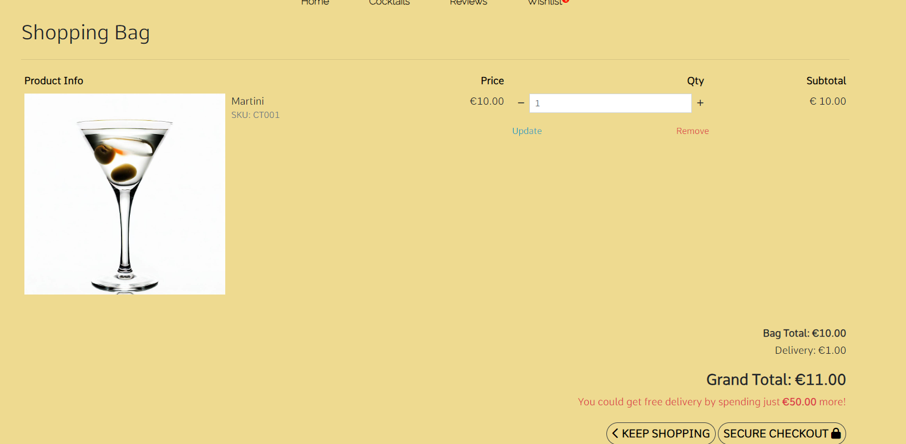

### Checkout page

* On the checkout page, users can review their selected products before making a purchase. The page displays a summary of the items, including featured images, additional details, and the option to proceed with the checkout process connected via Stripe API.

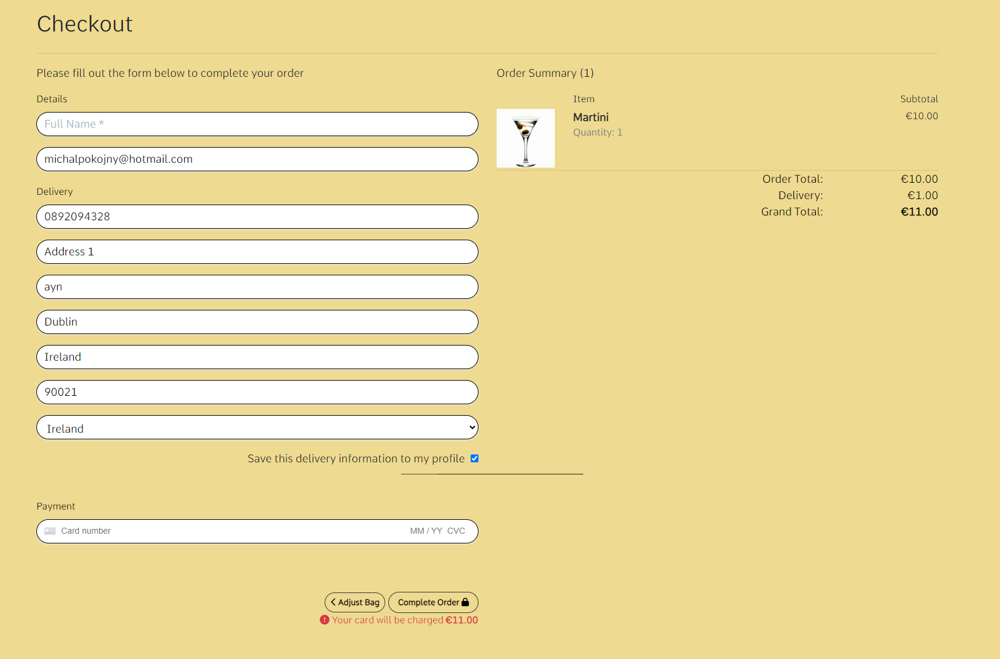

### Product managment

* If the user has admin privileges, they have access to additional features for managing products. This includes adding new products including an image, editing existing products, and deleting products.

* Adding product

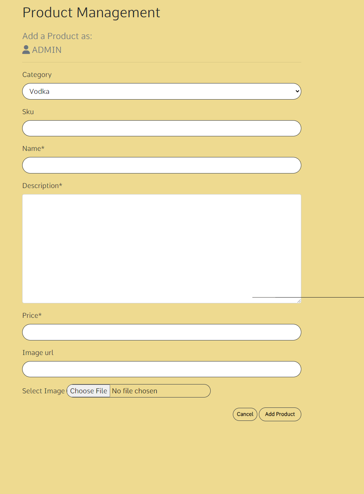

* Editing Product

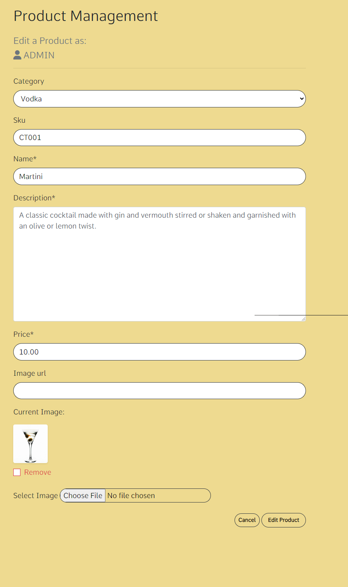

* Deleting Product

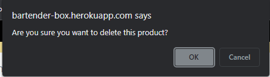

### Search page

* The search page allows users to search for specific products using keywords. The search results page displays all the relevant products based on the search query.

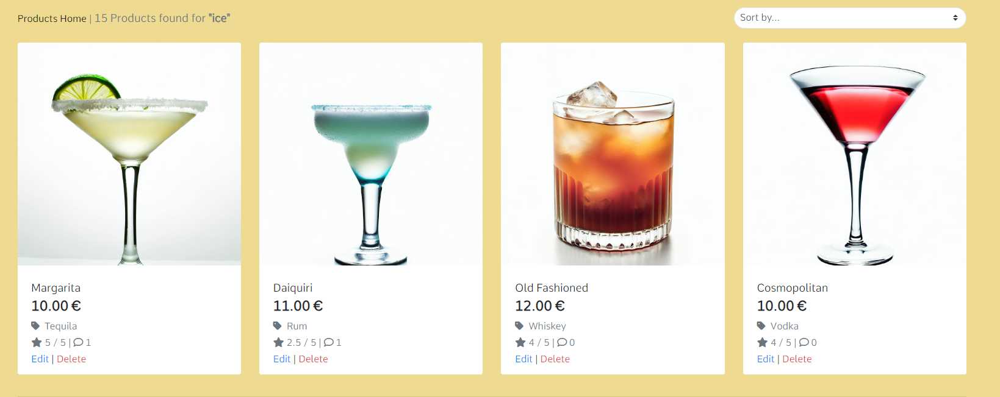

## Additional features

* The website includes a newsletter feature where users can subscribe to receive updates. Upon subscribing, users will see a success message. In case of any errors, an appropriate error message will be displayed.

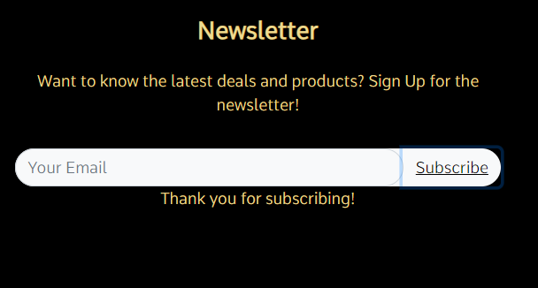

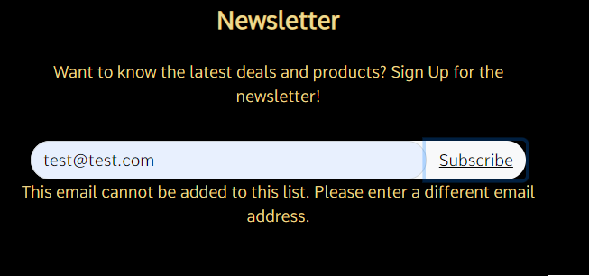

### Messages Container

* The messages container is a component that displays informative messages to the user after various actions, such as submitting a form, updating a profile, or adding a product to the shopping bag.

* When an action is performed, a message is shown in the container, providing feedback or confirmation to the user. The message remains visible for 5 seconds and is then automatically dismissed.

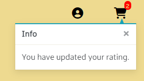

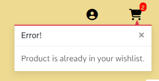

[Back to README.](./README.md)