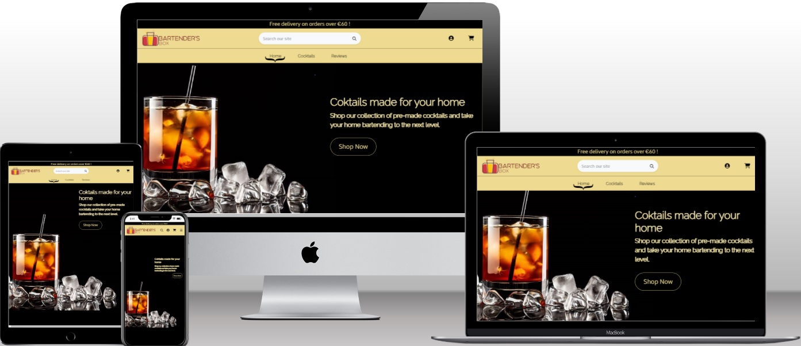
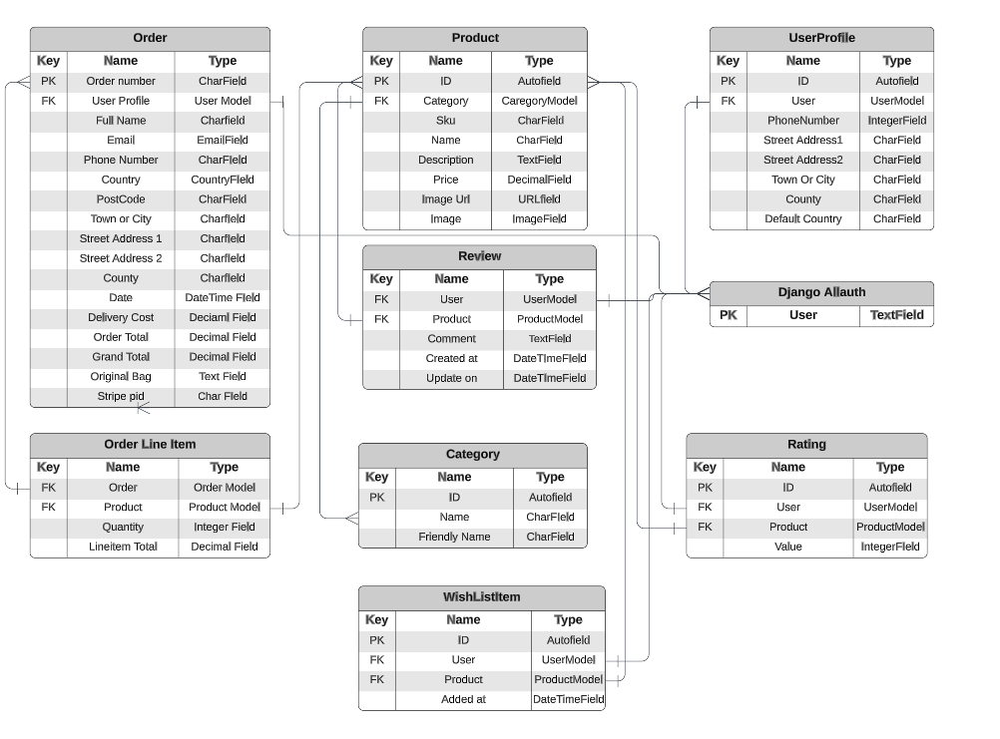
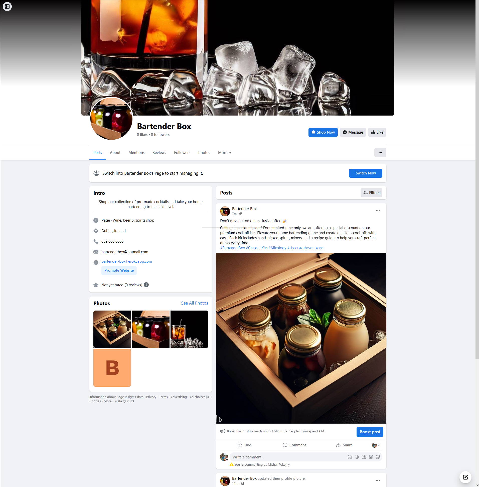

# Bartender Box

## Introduction

This project is an e-commerce website built to sell pre-made cocktails. The website is for users who wants to order and enjoy a variety of cocktails from the comfort of their homes. Unlike traditional recipe-based websites, Bartender Box focuses on providing a convenient way for users to purchase and consume ready-to-drink cocktails.

The website is built using Django framework, and follows an agile methodology approach for development.

[Live version of my project](https://bartender-box.herokuapp.com/)
  

## Table of Contents

- [Introduction](#introduction)
- [User Experience](#user-experience)
    - [Project Goal](#project-goal)
    - [User Stories](#user-stories)
    - [Scopes](#scopes)    
    - [Agile Methodology](#agile-methodology)
- [Design](#design)
    - [Wireframes](#wireframes)
    - [Database Diagram](#database-diagram)
    - [Typography and colour scheme](#typography-and-colour-scheme)
        - [Fonts](#fonts)
        - [Colour](#colour)            
- [Features](#features)
- [Future Features](#future-features)
- [Testing](#testing)
- [Technologies Used](#technologies-used)
- [Python Packages](#python-packages)
- [Deployment](#deployment)
    - [Deploying on heroku](#deploying-on-heroku)
    - [Fork repository](#to-fork-this-repository)
    - [Cloning](#cloning-this-project)    
- [Credits](#credits)
- [Acknowledgments](#acknowledgements)        
    
 

## User Experience
 

### Project Goal

* The goal of Bartender Box is to provide a platform for users to easily order and enjoy pre-made cocktails at home. The website eliminates the need for users to search for recipes and gather ingredients by offering a curated selection of ready-to-drink cocktails.
  

### User stories

|  | As a non-logged in user |
| --- | --- |
| 1. | I want to browse the available cocktails and view their details without having to create an account. |
| 2. | I want to search for specific cocktails or browse through different categories. |
| 3. | I want to easily navigate through the website and find relevant information. |
| 4. | I want to register on the website to place an order or save my shipping details. |
| 5. | I want to log in to the website once registered.  |

 

|  | As a logged in user |
| --- | --- |
| 1. | I want to add cocktails to my cart and place an order. |
| 2. | I want to view my order history and track the status of my orders. |
| 3. | I want to edit my profile information, such as my address and payment details. |
| 4. | I want to log out from the website. |
| 5. | I want to rate the product. |
| 6. | I want to review the product. |
| 7. | I want to add the product to my wishlist. |

 

|  | As a staff/superuser user |
| --- | --- |
| 1. | I want to manage the inventory of cocktails, including adding new cocktails and updating their details. |
| 2. | I want to manage user orders and update their status. |
| 3. | I want to manage user accounts and view their order history. |
| 4. | I want delete existing cocktails. |

 

### Scopes

User Registration and Authentication
- Users can create an account and log in to the website.
- Users can reset their passwords if forgotten.
- Users need to verify their email to register to the website.

Cocktail Catalog
- Users can browse the available cocktails without logging in.
- Cocktails are categorized for easy navigation.
- Users can search for specific cocktails by name or category.
- Each cocktail has a detailed page displaying its information and ingredients.

Shopping Cart and Checkout
- Users can add cocktails to their cart.
- Users can adjust the quantity of cocktails in the cart or remove them.
- Users can view the contents of their cart at any time.
- Users can proceed to the checkout page to place their order.
- Users can provide their shipping information and payment details during checkout.

Order Management
- Staff users can add new cocktails to the catalog or update existing cocktails.
- Staff users can manage user orders and update their status.
- Staff users can view user accounts and order history.

User Profile
- Users can view and edit their profile information, including address and payment details.
- Users can view their order history.

 

### Agile Methodology

The development of Bartender Box follows an agile methodology approach. The project is divided into iterations, or sprints, where each sprint focuses on delivering specific features and improvements. This allows for flexibility and adaptability throughout the development process.
All my user stories, sprint that can be accessed using GitHub Issues, which serverd as a roadmap for my development process can be found [here.](https://github.com/MichalPokojny/CI_project_5_bartender_box/issues?q=is%3Aissue+is%3Aclosed)

 

## Design

### Wireframes

The wireframes for this project can be accessed [here.](./WIREFRAMES.md)
  

### Database diagram

### Typography and colour scheme

#### Fonts

* For general body text I used font :

* For navigation bar I used font :

 

#### Colour

Colour pallet used for this website.

## Features

Features of this project can be accessed [here.](./FEATURES.md)
  

## Future features

* Add pagination numbers to display certain number of products per page.
* Upgrade to support social authentication in addition to normal login.
* Enable the author to edit or delete review comments.
* Allow registered users to upload profile images.

## Business Model

* The business model chosen for Bartender Box website is based on a traditional e-commerce approach, where customers have the option to make single purchases of bartending-related products.
* Customers are free to explore and buy products as they desire, without any recurring commitments. The online store offers a diverse range of cocktails. The focus is on providing a seamless shopping experience, secure payment processing, and efficient order fulfillment to ensure customer satisfaction.
* Newsletter subscriptions and a Facebook page are utilized as marketing strategies to promote the Bartender Box brand and attract customers.

##  Marketing

* The marketing strategy for Bartender Box incorporates a Facebook business page as a key component. The Facebook page serves as a platform to showcase the shop's news, promotions, and offerings, aiming to establish a positive brand image. Through consistent promotion of products and regular content updates, the page endeavors to enhance its visibility and draw in a growing customer base, encouraging them to make purchases from the online store.

## Testing

Testing of this project can be accessed [here.](./TESTING.md)
   

## Technologies Used

  -  HTML 5: Provides the main structure of the website.
  -  CSS 3: Used for styling the website.
  -  Bootstrap: Used for general styling and responsiveness of the website.
  -  Python: Used for the website's backend development.
  -  JavaScript: Used for website scripts, including sending emails.
  -  Django: Used as the web framework.
  -  AWS: Used for storing the website's static files.
  -  ElephantSQL: Used as the database for this project.
  -  Heroku: Used for hosting the website.
  -  GitHub: Used to store the repository.
  -  GitPod: Used as the workspace for the project.
  -  Balsamiq: Used for wireframe planning.
  -  Font Awesome: Used for icons on the website.
  -  Google Fonts: Used for fonts on the website.
  -  LucidChart: Used for creating the database diagram.
  -  Favicon.ico: Used for generating the website favicon.
  -  Coolors: Used for selecting the color palette of the project.
  -  LogoAi: Used for creating the website logo.
  -  Grammarly: Used for grammar checking all the text on the website and in the readme file.
  -  Google Chrome: Used for main testing of the website on all devices.
  -  Google Chrome Lighthouse: Used for testing the performance of each page.
  -  W3C HTML Validator: Used for validating the HTML code.
  -  Jigsaw CSS Validator: Used for validating the CSS code.
  -  Ci Python Linter: Used for validating the Python code.
  -  JSHint: Used for validating the JavaScript code.
  -  Bing Image Creator: Used for generate cocktail images for the website.
  -  Microsoft Word: Used for testing documentation.
  -  GitHub Copilot: Used to help understand developed code.
  -  Mailchimp: Newsletter subscription service.
  -  Facebook: Creating business page.
  -  Gmail: Sending and recieving emails from customers.

### Python packages

* asgiref
* backports.zoneinfo
* boto3
* botocore 
* dj-database-url
* Django
* django-allauth
* django-countries
* django-crispy-forms
* django-storages
* jmespath
* gunicorn
* oauthlib
* psycopg2
* PyJWT
* python3-openid
* pytz
* requests-oauthlib
* s3transfer
* sqlparse
* stripe

## Deployment

### Deploying on Heroku

For deployment this project on Heroku, you need to follow these steps:

1. Create Pipfile with all the required dependencies by running the command "pip3 > freeze > requirements.txt" in the terminal.
2. Go to the [Heroku](https://www.heroku.com/) website and create a Heroku account if you haven't already done so.
3. Create a new app by clicking the "New" button and selecting "Create a new app".
4. Choose a name for your app and select your location.
5. Log in to the [ElephantSQL](https://www.ElephantSQL.com.com/) for creating the dabase.
6. In the ElephantSQL click "Create New instance"
7. Set up your plan
8. Select Region
9. Select a data center near you
10. Click review
11. Click "Create instance"
12. Return to ElepantSQL dashboard and click on the "database instance name" for this project.
13. In the URL section, copy the URL
14. Back in the Heroku open settings tab and paste database url from ElephantSQL and Secret key to Config Vars.
15. Go to the "Deploy" tab and click on "Connect to GitHub" to connect your Heroku app to your GitHub Depositary
16. Finally, choose the main branch for deploying. Enable automatic deployment, and then select "manual deploy" to build your app.

### To Fork this repository:

1. Navigate to GitHub project repository [CI_project_5_bartender_box](https://github.com/MichalPokojny/CI_project_5_bartender_box)
2. Click on the "Fork" section in the right-hand corner.
3. Select an owner for the forked repository.
4. Click "Create fork" button.

### Cloning this Project

1. Visit [CI_project_5_bartender_box](https://github.com/MichalPokojny/CI_project_5_bartender_box)
2. Click green button "<> Code", then "Clone or download" button and copy the URL provided.
3. Open a terminal and navigate to the directory whre you want to clone the project.
4. Type following command and paste url "git clone \<url>"
5. Press Enter and the project will be cloned to you local machine.

## Credits

* https://www.youtube.com/@Codemycom Django walkthrough
* Inspiration and some of the code of this project were taken from [Code Institute walkthrough project](https://github.com/Code-Institute-Solutions/boutique_ado_v1) and fellow students at Code Institue.
* https://www.youtube.com/@KevinPowell CSS effects.

## Acknowledgements

* I want to thanks to Code Institute for learning material and support.
* Slack Code Institute community for all issues resolved and support.