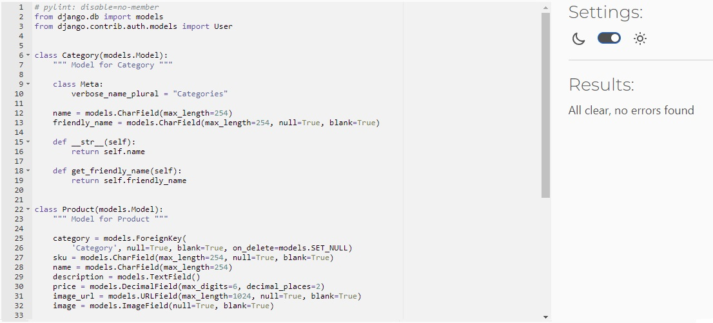

# Testing

## Code Validation

Python

* Python code was tested using PEP8 Code Institute [Python Linter Validator](https://pep8ci.herokuapp.com/)

 Validation Output

**Bag app**

apps.py

contexts.py

urls.py

views.py

**Bartender box app**

context_processors.py

urls.py

views.py

**Checkout app**

admin.py

apps.py

forms.py

models.py

signals.py

urls.py

views.py

webhook_handler.py

webhooks.py

**Home app**

apps.py

urls.py

views.py

**Products app**

admin.py

apps.py

forms.py

models.py

urls.py

views.py

widgets.py

**Profiles app**

apps.py

forms.py

models.py

urls.py

views.py

**Rating app**

apps.py

models.py

urls.py

views.py

**Wishlist app**

apps.py

models.py

urls.py

views.py

HTML

* HTML code was tested using [W3 Validator](https://validator.w3.org/)

Every page has passed the W3 validator

CSS

* CSS code was tested using [Jigsaw W3 Validator](https://jigsaw.w3.org/)

JavaScript

* Javascript code was tested using [JSHint](https://jshint.com/)

main.js

stripe_elements.js

## Browser Testing

The website has been tested thoroughly on several different browsers.

* Google Chrome
* Mozilla Firefox
* Microsoft Edge
* Safari
* Opera

### Google Chrome Lighthouse

Lighthouse was used to test performance, Accesibility, Best Practices and SEO of the website.

Desktop Results:

Mobile Results:

## User Story testing

**EPIC** - Wishlist Management

**USER STORY**: Add Product to Wishlist
Acceptance Criteria: A user should be able to add a product to their wishlist.

**Summary**:

- As a user, when viewing a product, I can click on the "Add to Wishlist" button to add the product to my wishlist.
The website should validate that the product is successfully added to my wishlist.
I can view my wishlist to see the added product.

**Status**: Pass

**EPIC** - Product Review

**USER STORY**: Review a Product
Acceptance Criteria: A logged in user should be able to review a product.

**Summary**:

- As a logged in user, I can navigate to a product detail page and find a "Write a Review" section.
I can enter my review and submit it.
The website should then display the review on the product page.

**Status**: Pass

**EPIC** - Product Rating

**USER STORY**: Rating products
Acceptance Criteria: A logged in user should be able to rate a product.

**Summary**:

- As a  logged in user, I can navigate to a product page and find a rating system (e.g., stars) to rate the product.
I can select the desired rating and submit it.
The website should validate the rating submission and update the product's average rating.

**Status**: Pass

**EPIC** - Privacy and Terms

**USER STORY**: Privacy policy and Terms & Conditions
Acceptance Criteria: Users should be able the website privacy policy and terms & conditions.

**Summary**:

- As a user, I can find links to the privacy policy and terms & conditions in the footer or navigation menu.
Clicking on these links should open the respective pages with the relevant information.

**Status**: Pass

**EPIC** - Management

**USER STORY**: Manage registered users 
Acceptance Criteria: Administrators should be able to manage registered user accounts.

**Summary**:

- As an administrator, I can access a user management section with a list of registered users.
I can view user details, including their username, email, registration date and also all order history details.
I can perform actions such as suspending or deleting user accounts, manage their orders.

**Status**: Pass

**USER STORY**: Delete products
Acceptance Criteria: Administrators should be able to delete existing products.

**Summary**:

- As an administrator, I can access a product management section with a list of existing products.
I can select a product and choose the option to delete it.
The system should prompt for confirmation before deleting the product.

**Status**: Pass

**USER STORY**: Add and update products
Acceptance Criteria: Administrators should be able to add and update product information.

**Summary**:

- As an administrator, I can access a product management section to add new products.
I can provide product details such as name, description, price, and image.
I can submit the form to add the product to the system.
As an administrator, I can also update existing product information.

**Status**: Pass

**USER STORY**: Check out
Acceptance Criteria: Users should be able to proceed with the checkout process.

**Summary**:

- As a user, when viewing my shopping cart, I can proceed to the checkout process.
I should be prompted to provide shipping and billing information.
I can review the order Summary and confirm the purchase.
The system should process the payment and display a confirmation message.

**Status**: Pass

**USER STORY**: Confirmation email
Acceptance Criteria: Users should receive a confirmation email after placing an order.

**Summary**:

- As a user, after successfully placing an order, I should receive a confirmation email.
The email should contain order details such as the products purchased, total amount, and shipping address.
The email should be sent to the email address provided during the order process.

**Status**: Pass

**EPIC** - User Profile

**USER STORY**: User profile
Acceptance Criteria: Users should be able to view and edit their delivery information.

**Summary**:

- As a user, I can access my profile page to view my delivery information.
I can edit and update delivery details.
The system should validate and save the changes made to my profile.

**Status**: Pass

**EPIC** - Communication

**USER STORY**: Newsletter
Acceptance Criteria: Users should be able to subscribe to a newsletter.

**Summary**:

- As a user, I can find an option to subscribe to a newsletter.
I can provide my email address and choose to subscribe.
The system should validate the email address and add it to the newsletter subscription list.

**Status**: Pass

**EPIC** - Authentication

**USER STORY**: Login and Log out
Acceptance Criteria: Users should be able to log in and log out of their accounts.

**Summary**:

- As a user, I can access the login page and enter my credentials (username/email and password).
Upon successful authentication, I should be redirected to the home page as a logged-in user.
I can log out by selecting the "Log out" option, which should invalidate the session and redirect me to the login page.

**Status**: Pass

**USER STORY**: Registration
Acceptance Criteria: Users should be able to create new account.

**Summary**:

- As a user, I can access the registration page and provide the required information (username, email, password, etc.).
After submitting the registration form, the system should validate the information and create a new user account.
Upon successful registration, I should receive a confirmation email with further instructions.

**Status**: Pass

**EPIC** - Shopping Cart

**USER STORY**: Shopping bag
Acceptance Criteria: Users should be able to add and manage items in their shopping cart.

**Summary**:

- As a user, I can add products to my shopping cart by selecting the "Add to Cart" button.
The system should display the updated cart **Summary**, including the total number of items and the total price.
I can view and manage the items in my shopping cart, including removing or updating quantities.

**Status**: Pass

**EPIC** - Product Sorting and Searching

**USER STORY**: Sorting products
Acceptance Criteria: Users should be able to sort products based on different criteria.

**Summary**:

- As a user, when viewing a list of products, I can select sorting options such as "Price Low to High" or "Rating High to Low".
The system should update the product list according to the selected sorting criteria.

**Status**: Pass

**USER STORY**: Search products
Acceptance Criteria: Users should be able to search for specific products.

**Summary**:

- As a user, I can enter a search query in a search bar.
The system should display relevant products matching the search query.
The search results should include product names, descriptions, and other relevant details.

**Status**: Pass

**USER STORY**: Open a product
Acceptance Criteria: Users should be able to view detailed information about a product.

**Summary**:

- As a user, I can click on a product to view its detailed page.
The product page should display information such as name, description, price, and reviews.
Users can navigate back to the product list or continue with other actions like adding to the cart.

**Status**: Pass

## Black box features manual testing

TEST PLAN

TEST DATA

TEST LOG

## Unsolved Bugs

[Back to README.](./README.md)